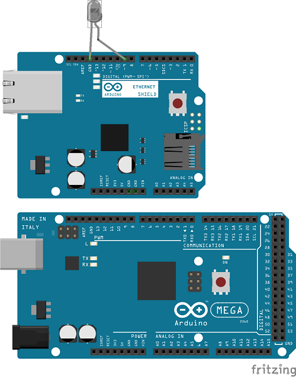

# Arduino-JenkinsNotify
RGB Arduino based Jenkins Notifications

# Requirements
## Hardware
[Arduino mega 2560](https://www.amazon.co.uk/dp/B0046AMGW0) or compatible clone
[Ethernet W5100 Network Shield](https://www.amazon.co.uk/dp/B00CQN2FDY/) or compatible clone
IR LED

Supported notification hardware:
* RGB lights driven via a 24 key IR remote
  
* [Pac-Man Plastic Ghost Lamp](https://www.amazon.co.uk/dp/B00IFC2YCC/)

## Jenkins
Install jenkins plugin https://plugins.jenkins.io/notification

## Arduino
Install library dependencies
* ArduinoJson
* IRremote
* [WebServer](https://github.com/sirleech/Webduino) - requires manual install

# Setup
## Hardware
Stack Network Shield on Arduino mega 2560
Connect IR LED to pin 9

## Jenkins
Configure job with the following settings
* Format:JSON
* PROTOCOL:HTTP
* EVENT:any
* URL:http://${IP}/status

## Arduino
1. Change IP and mac in jenkins_notify.ino
2. Upload sketch to Arduino
